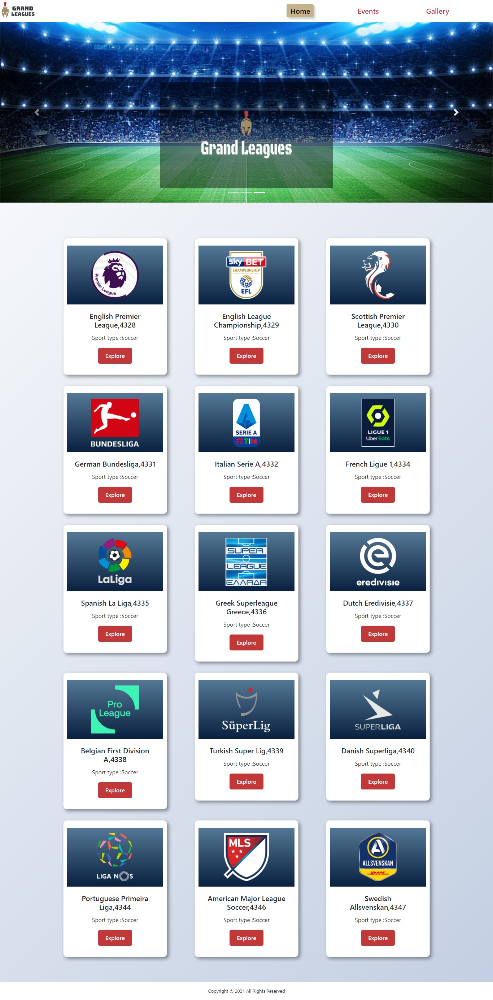

# React Router project
A web  application created with html,css,javascript,react,react-bootstrap.

## Features
In this web application anyone can learn about famous sport leages.the details about the sport leagues are also available in the website.They can easily access to any of the sport leagues social media and official website by clicking the icons on their own detal page.Visitors can also know about recent events organised by those leagues and their posters.And more over the site is responsite for any device.

## Tech/framework used

<b>Built with</b>

* html
* css
* javascript
* react
* react-router
* react-bootstrap
 
## Screenshots

.png)
.png)
.png)
.png)
.png)

## Installation and Setup Instructions

Clone down this repository. You will need `node` and `npm` installed globally on your machine.  

Installation:

`npm install`  

To Run Test Suite:  

`npm test`  

To Start Server:

`npm start`  

To Visit App:

`localhost:3000/ideas` 

## API Reference

API link : https://www.thesportsdb.com/api.php

## How to use 

*Go to the website home to view different leagues,badge and sport type
*Click on the **Explore** button to see the detail of each league
*On league detail page you can see all necessary in formation about the league such as formed year,country,logo,banner and description.
*on the navbar click on the **Events** link to see recent event information
*on the events page you can also watch highlights of each match on youtube by clicking **Watch vedio** button.
*to see different league posters and fannarts go to the **Gallery** page

## Credits
I have done this project as an assignment of programming hero web development course. Most of the technologies I have used here is taught by our respectable instructor Jhankar Mahbub.

## License

© [Tasnuva Rahman](https://github.com/tasnuvatina)

